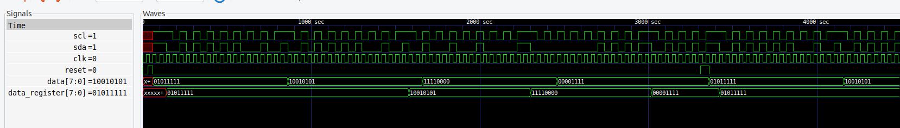

## Hardware 2 wire protocol to send sensor data through 2 wires

It just sends data[NBITS] bit by bit through sda wire, while scl acts as clock. Before each frame is sent it places a header so de reader can know message start. Header is about having both signals being high to then make sda fall. After that sdc will also fall and data will be send.

TODO: make synthesized output to work. (bottom gtkwave window)

run make lint to lint the verilog code using verilator
https://projectf.io/posts/verilog-lint-with-verilator/